# E-Commerce App

A dummy e-commerce app that simulates the experience of shopping for products online. **NOTE: The packages used have since updated their syntax and some LOC may show syntax errors**

Features:

- View available products along with their reviews and ratings
- Give reviews and ratings for products (with edit option)
- Search for products by name
- Add prodcuts to cart and use discont codes
- View and track orders with automated notifications
- Detect objects in real time to find similar products
- View select items in Augmented Reality (beta)

Admin Features:

- Add and deleted products
- View products statistics - views and sales on a daily basis

## Tools Used

The app was built entirely on [Flutter](https://flutter.dev/) and runs on services provided by [Firebase](https://firebase.google.com/). 

The following Firebase services were used in this app:

- Firestore: Store product and user data
- Cloud Messaging: Send push notifications
- Functions: detect changes in Firestore and send automated notifications via FCM
- Analytics: Track which products are generating high sales as well as track user screen interactions

## Screenshots

### Login

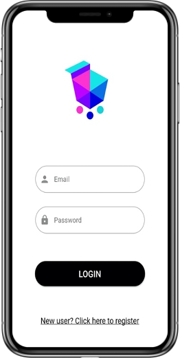

### Home

 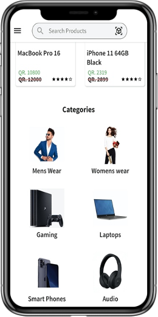 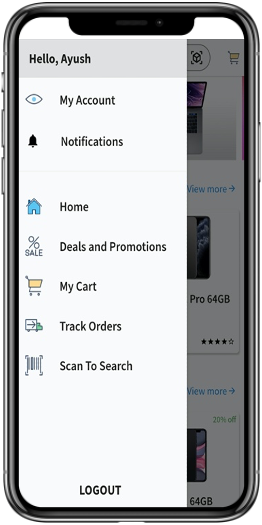

### Product Description

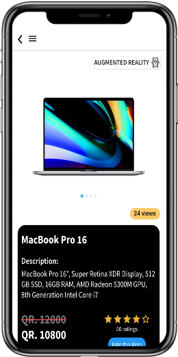 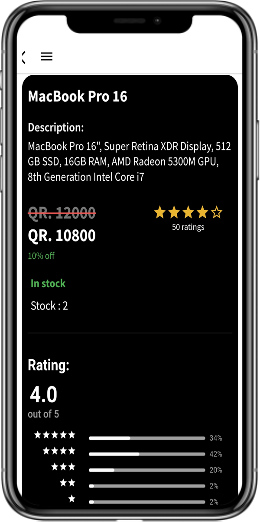

### Cart and Promo codes

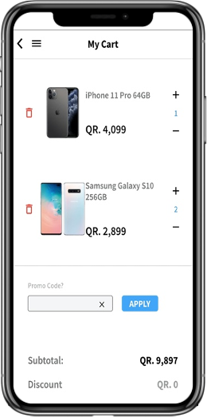 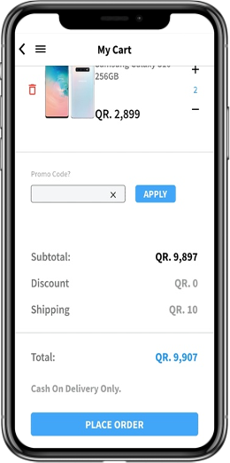

### Order History

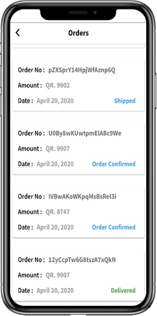 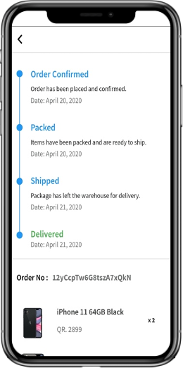 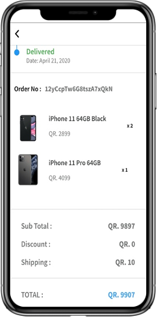

### Object Detection

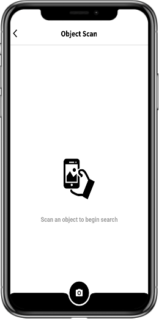 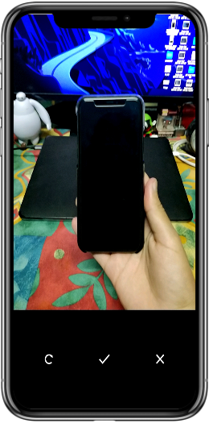 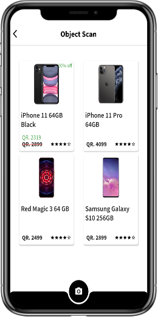
